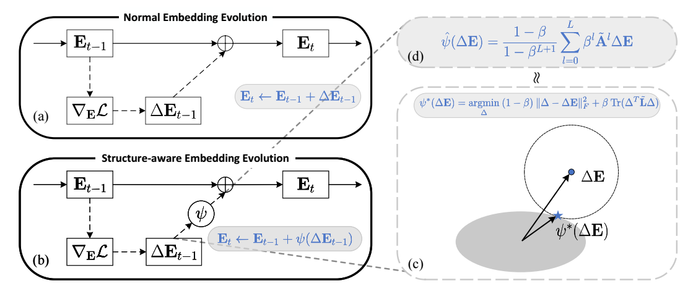

<div align="center">
  
</div>

This is the official implementation of [Graph-enhanced Optimizers for <u>S</u>tructure-aware Recommendation Embedding <u>Evo</u>lution](https://arxiv.org/abs/2310.03032).

**Note:** We provide this code for precise reproduction of the results reported in the paper, which may be a bit troublesome to prepare the environment. [SEvo-latest](https://github.com/MTandHJ/RecBoard/tree/master/SEvo) provides an alternative supporting latest `PyTorch/PyG/FreeRec`.





## Requirements

Run the following commands to prepare the environment (**CUDA: 11.3/11.6**):

```
conda create --name=PyT12 python=3.9; conda activate PyT12; bash setup_env.sh
```


## Usage

We provide configs and experimental logs for the Neumann series approximation with re-scaling. You can re-run them and try some other hyperparameters:

```
python main.py --config=configs/xxx.yaml --optimizer=AdamWSEvo --aggr=neumann --L=3 --beta3=0.99 --H=1
```

- optimizer: AdamWSEvo|AdamW|AdamSEvo|Adam|SGDSEvo|SGD
- aggr: neumann|iterative
- L: the number of layers for approximation
- beta3: $\beta$
- H: The maximum walk length allowing for a pair of neighbors